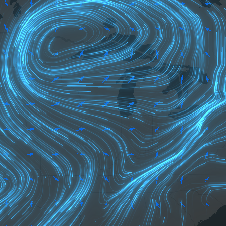

# wind-es

**wind-es** is ... [ArcGIS API for JavaScript](https://developers.arcgis.com/javascript/latest/) ... [custom layer views](https://developers.arcgis.com/javascript/latest/sample-code/custom-gl-visuals/).

## Live demos

- Magnitude/direction wind: https://wind-es.s3.us-west-1.amazonaws.com/demos/winds.html
- UV ocean currents: https://wind-es.s3.us-west-1.amazonaws.com/demos/currents.html
- Client-side data: https://wind-es.s3.us-west-1.amazonaws.com/demos/vortices.html

## Features

- A custom WebGL layer compatible with `MapView`.
- Visualize flow using animated lines.
- Support UV tiled imagery layers and magnitude/direction tiled imagery layers.
- Can be used in conjunction with [blend modes and layer effects](https://developers.arcgis.com/javascript/latest/sample-code/intro-blendmode-layer/).

## Instructions

1. Clone the repo.
2. `npm install`
3. `npm start`
4. Point your browser to `http://localhost:3000`

## Requirements

- Notepad or your favorite code editor.
- Web browser with access to the Internet.

## Resources

- [Live demos](https://wind-es.s3.us-west-1.amazonaws.com/index.html)

## Issues

Find a bug or want to request a new feature? Please let us know by submitting an issue.

## Contributing

Esri welcomes contributions from anyone and everyone. Please see our [guidelines for contributing](https://github.com/esri/contributing).

## Licensing

Copyright 2021 Esri
Licensed under the Apache License, Version 2.0 (the "License");
you may not use this file except in compliance with the License.
You may obtain a copy of the License at
http://www.apache.org/licenses/LICENSE-2.0
Unless required by applicable law or agreed to in writing, software
distributed under the License is distributed on an "AS IS" BASIS,
WITHOUT WARRANTIES OR CONDITIONS OF ANY KIND, either express or implied.
See the License for the specific language governing permissions and
limitations under the License.
A copy of the license is available in the repository's [LICENSE.txt](https://devtopia.esri.com/dari8942/wind-es/blob/main/LICENSE.txt) file.
